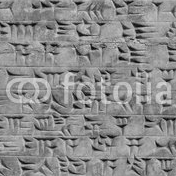
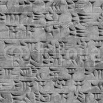
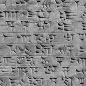

## Exploiting Watermark Consistency

#### *Attempt* at replicating Dekel et. al: [On the Effectiveness of Visible Watermarks](http://openaccess.thecvf.com/content_cvpr_2017/papers/Dekel_On_the_Effectiveness_CVPR_2017_paper.pdf)

##### Contained is source code, and details of our implementation, as well as a thorough evaluation of the algorithm both quantitatively and qualitatively presented in an IEEE conference type format. While the algorithm does not perform as desired, it was a great project to work on and a great learning experience!

___
### Sample Results

Watermarked Images             |  Our Results             |  Expected Results
:-------------------------:|:-------------------------:|:-------------------------:
  |    |  
  |    |  
  |    |  
  |    |  

___
###### *please see code + report for citations of work we used during development :)*
